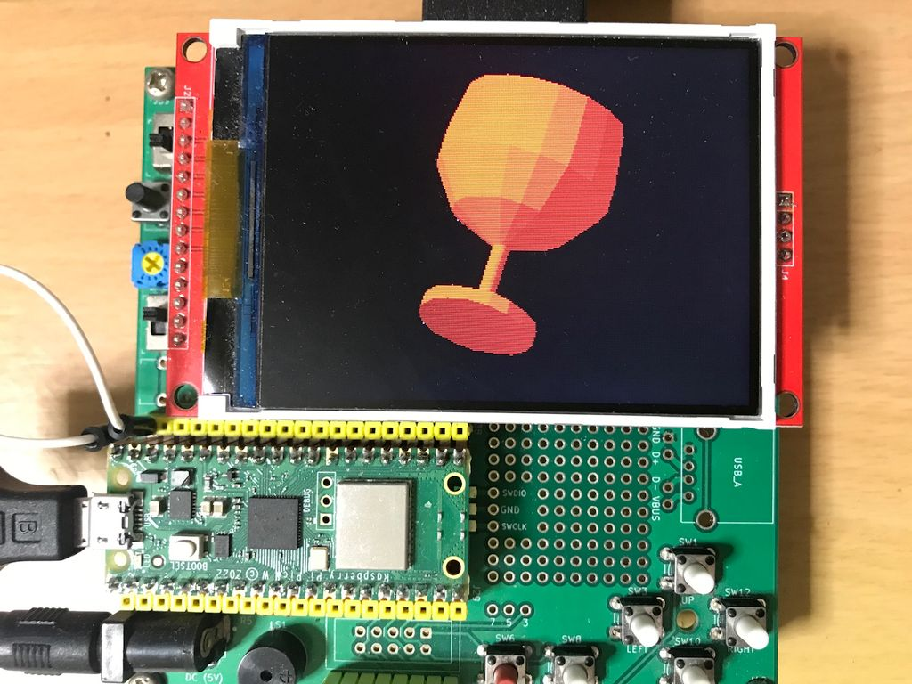

# BASICマイコンMachiKania type Pによるポリゴングラフィック
ワイングラスのようなY軸で対称な3Dモデルのエッジデータでポリゴングラフィックを描画するBASICプログラム。  
MachiKania type Pの上下左右ボタンでX軸、Z軸回転させることができます。  
冒頭の変数Dを変更することで、回転方向の分割数を変更することができます。  
このプログラムはMachiKania type Mでもそのまま動作します。  
 
 
